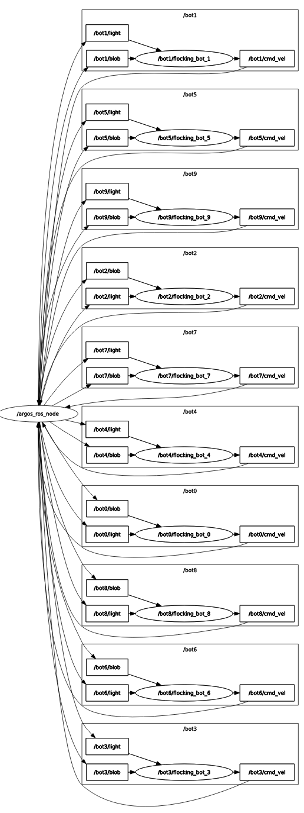

# Start up

# Download and build
```bash
mkdir flocking_ws/src
cd flocking_ws/src
git clone https://github.com/CPS-Konstanz/footbot-flocking.git
```
Before you build flocking package, you need source the argos3_ros2_bridge envoriment.

```bash
cd flocking_ws
source ../YOUR_BRIDGE_ws/install/setup.bash
colcon build
```

## Launch simulation environment

You need export the bridge'lib path before launch argos experments.
```bash
export LD_LIBRARY_PATH=$LD_LIBRARY_PATH:/usr/local/lib/argos3:/YOUR_ARGOS3_ROS2_BRIDGE_PATH/lib
export ARGOS_PLUGIN_PATH=/YOUR_ARGOS3_ROS2_BRIDGE_PATH/lib
argos3 -c flocking.argos
```

## Launch controller node
```bash
source install/setup.bash
ros2 launch flocking flocking.launch.py
```

## Launch manual test robot
```bash
ros2 run teleop_twist_keyboard teleop_twist_keyboard --ros-args -r cmd_vel:=bot0/cmd_vel
```

## NODE_GRAPH

